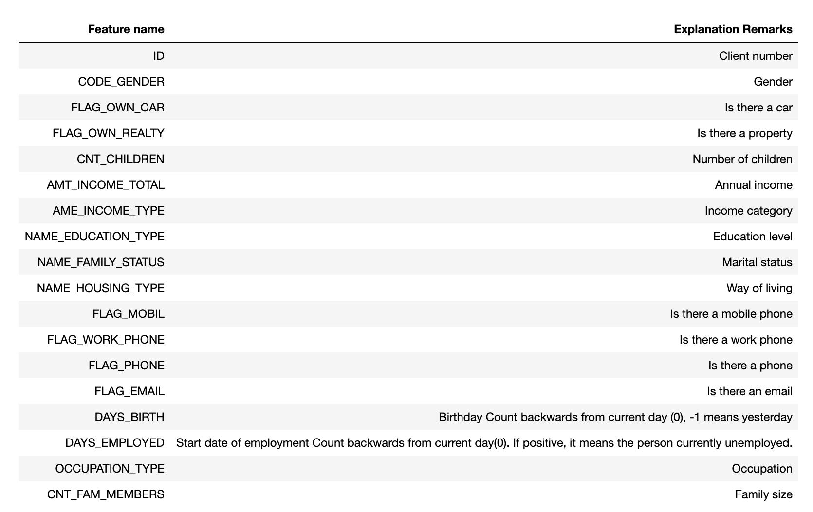
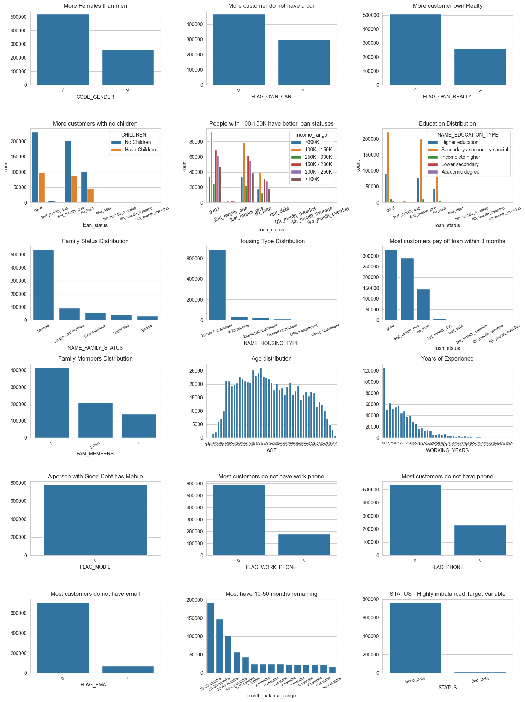
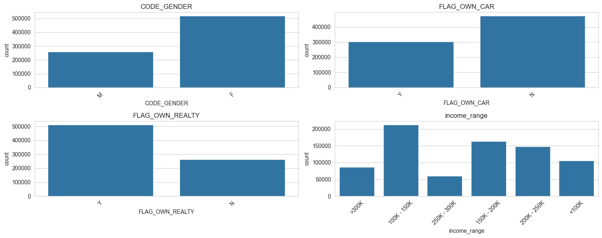
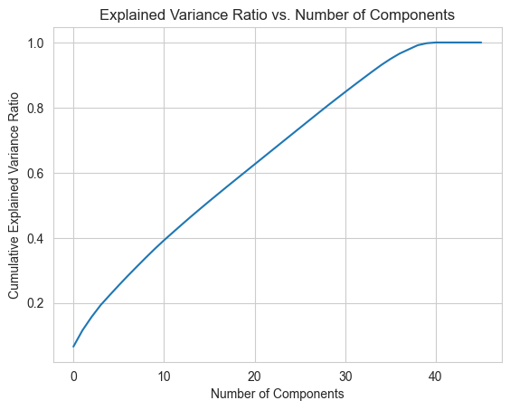
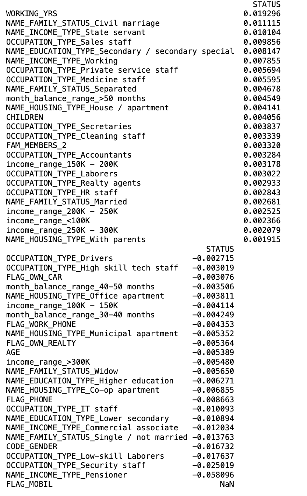
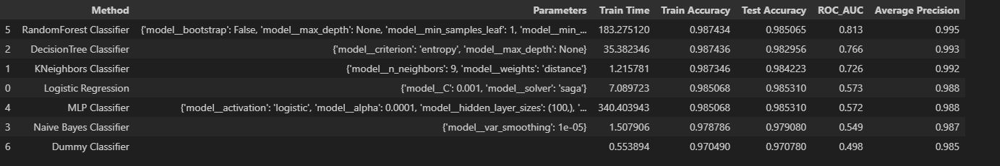
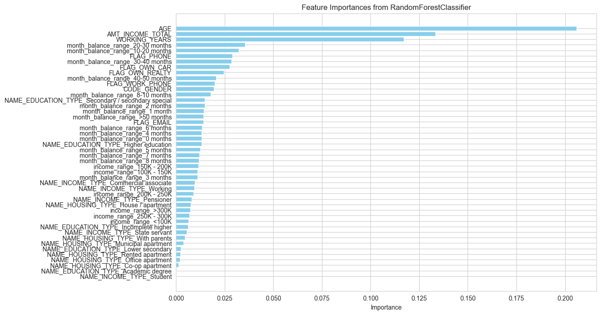
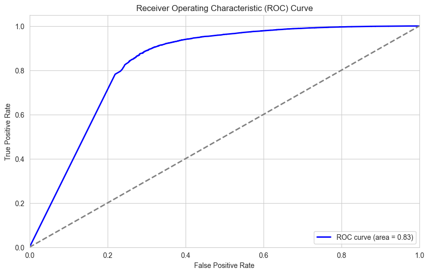

### Detecting Credit Card Approval
**Goal/ Question:** 
Credit score cards are a common risk control method in the financial industry. It uses personal information and data submitted by credit card applicants to predict the probability of future defaults and credit card borrowings. The bank is able to decide whether to issue a credit card to the applicant. Credit scores can objectively quantify the magnitude of risk. The goal of this project is to predict the likelihood of an applicant getting credit card approval.

**Data Problem:** The data task is to train and tune data to be identify key dimensions that help build a highly accurate model that predicts the credit score and hence credit card approval rate. This will enable the credit companies to identify the risky applicants from non-risky applicants.

**Data**

The data is sourced from Kaggle.

Link: 
https://www.kaggle.com/datasets/rikdifos/credit-card-approval-prediction/data?select=application_record.csv
https://www.kaggle.com/datasets/rikdifos/credit-card-approval-prediction/data?select=credit_record.csv

### Understanding the Data

#### Import and Setup

### Understanding the Features and Target variable
#### Checking data type of features and looking for null values

### There are null values but no unknown values

## Visualizing Features and Target variable

SMOTE technique used to compensate for highly imbalanced Status variable. All calculations are redone using this credit record data.

### Observation:
- There are more Female clients in our dataframe than the male clients
- The number of clients who don't have car is more than the number of clients who have car
- More number of clients have their own property
- Most of the clients in our dataset have paid off their loan for that month
- 
first month loan due and no loan for the month comes at 2nd and 3rd place respectively in terms of value count
- As our dataset has more number of females than males so the count of female is larger than the count of males who have paid off their loan for that month and have no loan for the month
- 
Moreover, the females have more over due and bad debt than male
sbt

## Data Pre-processing and Data Clean up

Multicollinearity occurs when two or more predictor variables in the model are highly correlated.

Variance Inflation Factor (VIF) is 1.0 for all columns except children, family_status and mobile which are highly correlated with each other.

Hence, we need to drop children , family_status & mobile columns from our independent variable list to get best results.

## Feature selection

#### Principal Component Analysis shows 35 features show 95% of cumulative explained variance

## Arriving at hyper parameters for Classifiers
#### Using subset of data to arrive at hypertuned parameters before true comparisonayes

I have compared the following models:
- Logistic Regression
- Decision Trees
- K-Nearest Neighbors 
- Support Vector Classifiers
- Neural Network model
- Random Forest model
- Naive Bayes

## Comparing different Classifiers

### Curve Shape:

Rises Quickly: The curve rises quickly towards the top-left corner, indicating that the classifier is good at distinguishing between the positive and negative classes.
High TPR, Low FPR: A higher TPR with a lower FPR means the classifier correctly identifies most of the positive instances while minimizing false positives.

### ROC AUC Score:

Value: The ROC AUC score, displayed in the legend (e.g., area = 0.82), is close enough to 1.0. This indicates good model performance.
Interpretation: An ROC AUC score of 0.82 means that there is a 82% chance that the classifier will rank a randomly chosen positive instance higher than a randomly chosen negative one.

### Conclusion:
AGE, AMT_INCOME_TOTAL, WORKING_YEARS - Financial and demographic variables have a strong impact on predictions.

Monthly Balance Ranges (20-30, 10-20, 30-40 months) - Indicates significant influence from financial stability and transaction history.

Ownership Indicators (FLAG_PHONE, FLAG_OWN_CAR, FLAG_OWN_REALTY) - Reflects asset ownership as a potential predictor of credit approval.

The analysis of the credit card approval dataset provided significant insights into the factors affecting loan approval status. A comprehensive data exploration revealed key patterns, such as the dominance of certain demographic features (e.g., gender, age, income level) and financial attributes (e.g., asset ownership, months of balance). The data also exhibited substantial imbalance in the target variable, with a higher proportion of "Good Debt" records.

The modeling phase involved evaluating multiple classification algorithms, with the RandomForest Classifier emerging as the top performer, achieving the highest accuracy (98.51%) and ROC AUC (0.813). This model leveraged key features such as AGE, AMT_INCOME_TOTAL, and WORKING_YEARS, underscoring the predictive significance of financial stability and age in creditworthiness.

However, while the RandomForest Classifier demonstrated robust performance, its computational cost was notably high. For more efficient and interpretable predictions, the DecisionTree Classifier and Logistic Regression offer competitive accuracy with reduced processing time.

Further analysis through PCA highlighted the potential to reduce feature dimensionality while maintaining predictive power, suggesting future scope for optimization and model tuning. Additionally, the observed class imbalance warrants further exploration of resampling techniques to enhance model generalization and mitigate overfitting.

Overall, the analysis emphasizes the critical role of demographic and financial attributes in loan approval decisions, with actionable insights for targeted credit risk assessment and potential avenues for model refinement

### Next Steps
Model Monitoring and Maintenance:

Establish a framework for model monitoring and drift detection, tracking prediction performance over time.

Regularly update the model based on new data and evolving trends, ensuring sustained accuracy and relevance
